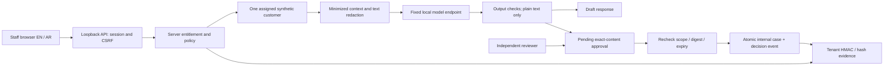

# Architecture, trust and human control

## Implemented system

Python 3.11+ standard library HTTP API, SQLite persistence, vanilla JavaScript/CSS UI. Windows clean setup tested with Python 3.13.3. No paid service, external asset CDN, telemetry, API key or package installation is required for the deterministic demo. Real generation uses the separately installed local Ollama service and Qwen2.5:0.5b. The default launch performs no downloads. The explicit `--prepare-model` option starts installed Ollama if needed and downloads the fixed model once when absent; subsequent inference is local.

No model-generated tool call is executed. `draft_case` produces a draft; `file_case` requests permission to store that exact draft as an internal SQLite case. It never changes a bank account or sends an email. The consequential action demonstrated is internal case recording, not a financial transaction. A reviewer must judge factual accuracy and suitability, including local-model errors.

## Data and boundaries

Browser → API is untrusted input. A session supplies user/tenant/role, and the session refreshes entitlements from the configured server map. Request schema rejects added identity/tenant fields. Model/tool names are checked against an allowlist. One-customer scope is checked before retrieval. Customer fixtures are explicitly synthetic and use reserved `.invalid` email domains and invalid-checksum IBAN-like values. Applicant identity is never used as a customer fixture.

API → model sends only chosen case ID, business segment, review status and redacted user/source text. Source notes are untrusted. Known names and basic Civil-ID/phone/email/card/IBAN patterns are covered, including Arabic-Indic digits and Unicode normalization. This is not a general Arabic named-entity recognizer. Unknown names, addresses, encoded identifiers, inference attacks and novel prompt attacks may evade detection. Tool and retrieval restrictions remain necessary regardless of detector performance.

Model → API is untrusted text, inspected again and displayed using escaped text. It cannot select an outbound URL, read a second customer, execute code or approve a case. The Ollama destination is hard-coded to loopback and no request field can change it. The model service's own host security and network isolation are outside this application.

API → evidence stores hashes and decision metadata, not raw prompt/output. Hashes can be dictionary-attacked if input is predictable; they do not make evidence anonymous. Pending and filed case text remains in the local SQLite database. No claim of database encryption is made. Generated secrets and credentials are runtime-only and excluded from the source archive.

## Authentication and approval details

Five separate demo accounts across two tenants; random startup passwords; per-user salted scrypt hashes. Session tokens and CSRF tokens are random, session cookies are HttpOnly and SameSite=Strict, and lifetime is 30 minutes. A new login revokes that account's preceding session. Login attempts are bounded per source over a minute. Host and Origin restrictions defend the loopback service from unexpected browser origins. Local HTTP does not provide transport confidentiality and is not appropriate for a bank network. No remote binding option exists in the launcher.

Approvals expire after 15 minutes and bind requester, tenant, customer, allowed action, complete output, model, language, content digest and policy version. RM cannot approve. A same-tenant reviewer assigned to that customer must present the displayed digest. Queue reads and both approval/rejection enforce the reviewer's current customer assignment; the backend also rechecks requester entitlement at execution. Approval status and case creation share a transaction under a lock, preventing replay and double execution. Rejection has no case side effect. Model error produces no approval or case. Policy 1.1 corrects a gap found during completion audit: reviewer role alone previously allowed same-tenant pending content despite removal of customer assignment.

## STRIDE-oriented threat review

| Threat and adversary | Implemented containment | Evidence / residual risk |
|---|---|---|
| Staff spoofs identity or tenant | Session-derived identity, strict schema, object assignment checks | API tests; compromised legitimate account retains its authorized scope |
| Note author injects instructions | Normalization, bounded patterns, minimized context, no model execution authority | Fixed attacks include two missed paraphrase/encoding requests; no extra retrieval/tool grant |
| Staff/model leaks data across customers | Query scope, reference checks, known-identifier redaction, post-generation filtering | Literal fixture leakage checks only; semantic privacy of unseen data unproven |
| Model requests outbound action | No arbitrary destinations or model tool calls; unsupported tools denied | Controlled exfiltration tests; host compromise can bypass application |
| RM approves own case / reviewer replays | Different role and actor, exact digest, expiry, transaction and unique case approval | Negative and concurrency tests; colluding humans are outside this control |
| Evidence editor changes event | Per-tenant previous hash and keyed HMAC, integrity check before processing and commit | Tamper test fails closed. Attacker controlling key+DB can forge evidence |
| Evidence editor removes tail | Export final hash and retain separately; verifier compares trusted head | Local chain alone cannot detect a coherently truncated tail. External anchor is required |
| Browser XSS / framing / request forgery | Escaped rendering, CSP, frame denial, CSRF token and origin checks | Browser E2E and negative tests; browser extension/host compromise excluded |
| Service failure or resource pressure | Bounded payloads/model output, model timeout, no action on model failure | Single-process local demo; no HA, bank load qualification or distributed rate limiter |
| Dependency/model supply chain | No Python package dependencies; fixed model route and captured model digest | Python, browser, OS and Ollama still require patching and assurance |

## Deployment and operational boundaries

“Bank-deployable” describes the intended private-network architecture, not current production readiness. “Sovereign” means the intended bank-operated data path can stay under bank control; it is not a certification, geographic attestation or claim that all infrastructure is Kuwaiti. The shipped localhost demo is not production infrastructure.

Before any bank deployment: replace demo accounts with bank IdP and MFA; use TLS/mTLS and bank network segmentation; manage keys outside the app host; encrypt storage; export to protected independent evidence storage; define retention; validate Arabic/English PII with representative consented data; independently test integrations; establish operational ownership, monitoring, capacity, backup/recovery and regulatory review. Existing bank systems remain authoritative.

Backup/recovery for the demo: stop the app, copy the complete runtime directory including database and key to a protected location, then restore together. Verify the previously retained exported head. Never substitute a new key for an existing log. Missing key or altered chain causes startup failure. A full-history integrity check on every request is intentionally simple but grows with log size; the measured demo does not establish production scalability.

Emergency human boundary: stop the local API or revoke a configured user; pending requests do not execute themselves. There is no scheduler, autonomous agent loop or outbound communication tool.
